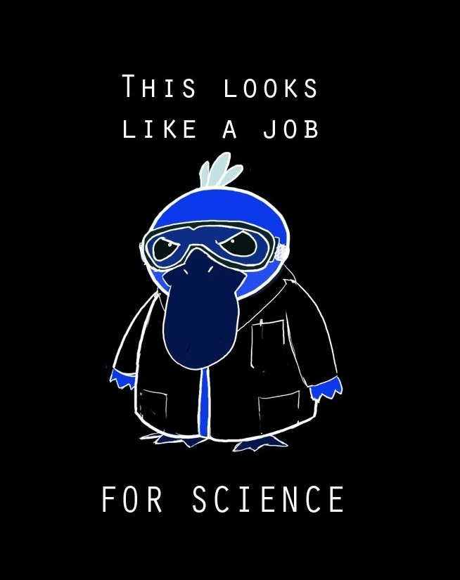

# Aviral Verma - Academic Portfolio Website

A clean, minimal academic portfolio website showcasing research projects and academic work. Built with Jekyll and inspired by Frank Chimero's elegant typography-focused design principles.



## 🎨 Design Philosophy

This website follows a **Frank Chimero-inspired design** with:
- **Typography-focused layout** with generous whitespace
- **Sticky section navigation** - section headings remain visible while content scrolls
- **Side-by-side layout** - content flows naturally while maintaining visual hierarchy
- **Minimal, clean aesthetic** prioritizing readability and content

> **Design Inspiration**: [frankchimero.com](https://frankchimero.com/) - A masterclass in web typography and layout design

## ✨ Features

- **📱 Fully Responsive**: Works seamlessly on all devices
- **🔬 Project Showcase**: Interactive grid with hover overlays
- **🎨 Modern Design**: Frank Chimero-inspired layout with sticky navigation

## Quick Start

### Prerequisites
- Ruby (3.0+)
- RubyGems
- Bundler

### Installation

1. **Clone the repository**
   ```bash
   git clone https://github.com/avi-xd/Aviral.git
   cd Aviral_single_page
   ```

2. **Install dependencies**
   ```bash
   bundle config set --local path 'vendor/bundle'
   bundle install
   ```

3. **Run the development server**
   ```bash
   bundle exec jekyll serve --host 0.0.0.0 --port 4000
   ```

4. **Access your site**
   ```
   http://localhost:4000/Avi_web/
   ```

## 📁 Project Structure

```
📦 Aviral_single_page/
├── 📄 _config.yml          # Site configuration
├── 📄 index.html           # Main single-page layout
├── 🎨 css/main.scss        # Custom styles (Frank Chimero-inspired)
├── 📂 _layouts/
│   ├── 📄 project.html     # Individual project page template
│   └── 📄 single-page.html # Main site layout
├── 📂 _projects/           # Project markdown files
│   ├── 📄 magnon-visualisation-system.md
│   ├── 📄 high-tc-superconductors.md
│   ├── 📄 electronic-properties-superconductors.md
│   ├── 📄 ml-holographic-microscopy.md
│   ├── 📄 quantum-computing-cirq.md
│   ├── 📄 scattering-external-potential.md
│   ├── 📄 hovhs.md
│   ├── 📄 ising-model.md
│   └── 📄 mesoscopic.md
└── 📂 images/              # Profile and project images
```

## 🎯 Customization

### Adding New Projects

1. Create a new `.md` file in `_projects/`
2. Add frontmatter with project details:
   ```yaml
   ---
   layout: project
   title: "Your Project Title"
   category: "Research" # or "Course Project"
   institution: "Your Institution"
   timeline: "Month Year - Month Year"
   supervisor: "Dr. Name"
   description: "Brief description"
   ---
   ```
3. Add the project card to `_layouts/single-page.html`

### Updating Profile Information

Edit `_config.yml`:
```yaml
author:
  name: 'Your Name'
  email: your.email@domain.com
  image: '/images/your-profile.jpg'

social:
  - title: "Email"
    url: "mailto:your.email@domain.com"
  - title: "GitHub"  
    url: "https://github.com/yourusername"
```

## 🛠️ Technologies Used

- **[Jekyll 4.4+](https://jekyllrb.com/)** - Static site generator
- **[MathJax](https://www.mathjax.org/)** - Mathematical notation rendering
- **HTML5 & CSS3** - Modern web standards
- **Flexbox & CSS Grid** - Responsive layout system
- **SCSS** - Enhanced CSS with variables and nesting

## 📊 Academic Features

### LaTeX Math Support
```latex
$$\mathbf{J} = -\frac{n_s e^2}{m} \mathbf{A}$$
```

### Project Categories
- **Research Projects**: Summer internships, research work
- **Course Projects**: Academic coursework and assignments
- **Personal Projects**: Independent work and contributions

### Responsive Design
- **Desktop**: Side-by-side layout with sticky navigation
- **Mobile**: Single-column stacked layout for optimal mobile experience

## 🎨 Design Credits

This website's design is inspired by **[Frank Chimero](https://frankchimero.com/)**, particularly:
- Typography-focused layout principles
- Sticky section navigation pattern
- Minimal, content-first design philosophy
- Elegant use of whitespace and hierarchy

Frank Chimero's work demonstrates how thoughtful design enhances content readability and user experience.

## 📧 Contact

**Aviral Verma**
- 📧 Email: [aviral.verma@niser.ac.in](mailto:aviral.verma@niser.ac.in)
- 🐙 GitHub: [@avi-xd](https://github.com/avi-xd)
- 🎓 Institution: NISER Bhubaneswar

## 📄 License

This project is licensed under the MIT License - see the [LICENSE](LICENSE) file for details.

---

<!-- > *"The best way to make something clear is to give it space."* - Frank Chimero -->